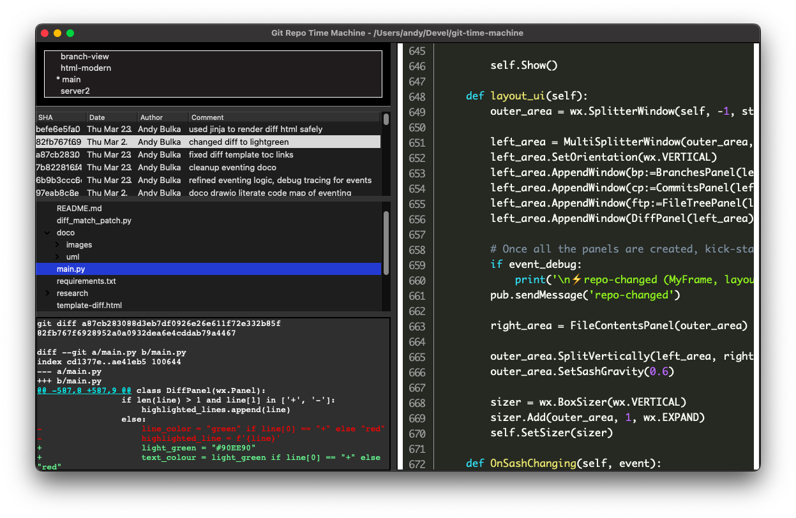

# Git Time Machine

An app that uses git to view the state of your source code directory at any commit incl. contents of any file.

> The missing git UI feature: view the contents of any file at any commit - visually and easily.

Sure you can do this with git log and git show etc. but this is a lot easier.

## Usage Tip
Click on a commit and then click on a file to see the contents of that file at that commit.

Then up/down arrow keys to navigate through the commits, and watch the file contents change. 🎉

Why vscode git plugins like GitLens don't do this is beyond me.  One cool (paid) app that *does* do this is [Fork](https://fork.dev/).

## Fun Fact 
I started this app using ChatGPT using the following prompt:

> write a python program that runs git commands. it will first get the list of commits hashes and store them in a list. Then it will prompt for a filename. It will then display the contents of the file at the commit with hash, the most recent commit hash. Then it will ask you if you want to see the same file at the next commit hash, etc. till you answer no.

